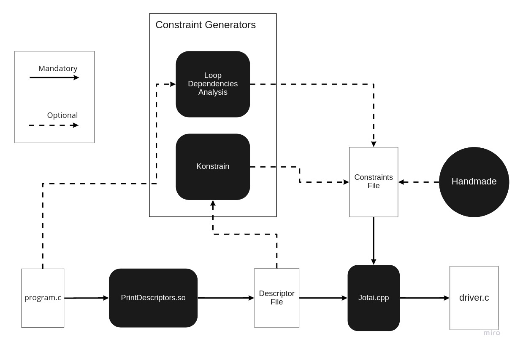

Jotai
-----
-----
A C benchmark generator

- [Building the project](#building-the-project)
  - [What you need](#what-you-need)
  - [A note on building Clang](#a-note-on-building-clang)
  - [Building Jotai](#building-jotai)
- [(Alternative) Using a Docker Image with Clang](#alternative-using-a-docker-image-with-clang)
  - [What you need](#what-you-need-1)
  - [Step by Step](#step-by-step)
- [Usage](#usage)
  - [What you need](#what-you-need-2)
  - [Running Jotai](#running-jotai)
  - [Running Jotai (without the scripts)](#running-jotai-without-the-scripts)
    - [Generating the driver](#generating-the-driver)
    - [Using CFGGrind on the driver](#using-cfggrind-on-the-driver)
- [Run examples](#run-examples)
- [What is Jotai?](#what-is-jotai)
- [Why is Jotai?](#why-is-jotai)
- [How is Jotai?](#how-is-jotai)
- [Konstrain: The Constraints Generator](#konstrain-the-constraints-generator)
  - [What you need](#what-you-need-3)
  - [Usage](#usage-1)
  - [Example](#example)
- [Loop Dependencies Analysis](#loop-dependencies-analysis)
  - [What you need](#what-you-need-4)
  - [How to run](#how-to-run)
  - [Example](#example-1)

# Building the project
## What you need

- Clang (You need to built it yourself, can't use precompiled binaries!)
- CMake
- GCC

## A note on building Clang
To use Jotai, you need to have [Clang](https://clang.llvm.org/) built on your machine. We used Clang version 12 when writing Jotai. If you haven't yet built Clang, I'd suggest taking a look at this 
[playlist](https://www.youtube.com/watch?v=HecW5byOrUY&list=PLDSTpI7ZVmVnvqtebWnnI8YeB8bJoGOyv).
It's a series of videos on the LLVM and Clang, and writing passes and plugins using their
libraries, and it has a tutorial on how to build Clang. Building Clang for the first time can be quite a frustrating experience, but once you get though it, you should be good to go :)


## Building Jotai
From project root:
```shell
mkdir build
cd build
cmake ../ -DLLVM_DIR=${LLVM_BUILD_DIR}/lib/cmake/llvm -DClang_DIR=${LLVM_BUILD_DIR}/lib/cmake/clang
make
```

# (Alternative) Using a Docker Image with Clang
Building the LLVM project yourself might be a bit troublesome, and take some time. An alternative is using a [Docker](https://www.docker.com/resources/what-container) image that already has the LLVM project compiled inside it. 

Note that this is different from using pre built binaries: the project is actually compiled in the operating system you get from the image, so you have access to all the libraries you get when you build LLVM!

Note that, if you are using Linux, you might need root access whenever you run a docker command! Just add "sudo" before every docker command listed below.

## What you need
- [Docker](https://docs.docker.com/engine/install/)

## Step by Step
- First, you need to create a DockerHub account [here](https://hub.docker.com/). This is where we'll get the image from.

- Then, login to your DockerHub account:
```shell
docker login --username your-username
```

- Get the [image](https://hub.docker.com/r/prodromou87/llvm) we'll use. It has Ubuntu 16.04 installed, and LLVM already compiled within:
```shell
docker pull prodromou87/llvm:8
```

- Then you need to find the image ID. You can find it using:
```shell
docker images
```

- Whenever you exit your docker container, all the data you created is lost. To avoid this, we need to setup a storage to keep your work:
```shell
docker volume create jotai
```

- Using the image ID and the storage you created, start and run the docker container, while registering it with a name:
```shell
# -it tells it to run iteratively, that is, open a terminal 
# for you to use the container.
# --name is the name you will use to run your container from now on
# source is the name of the storage you created
# target is the directory you will have inside your container where you
# can store data
# bash tells it to run your terminal using bash.

docker run -it --name jotai --mount source=jotai,target=/jotai imageID bash
```

Now you should be inside the docker container! Check that you can find a LLVM_ROOT directory. This is where LLVM is built.

There should also be a jotai folder. Any files in here will be stored; all other files you create will be lost when you exit!

And whenever you want to enter the container again afterwards, just run:

```shell
docker exec -it jotai bash
```

One final thing you need to do before building Jotai: this container has an older version of CMake than the one we need, so you'll need to install cmake as well! This is a bit of a pain, but you should only have to do it once.

```shell
apt update
apt install build-essential libssl-dev
cd jotai/
wget https://github.com/Kitware/CMake/releases/download/v3.20.2/cmake-3.20.2.tar.gz
tar -zxvf cmake-3.20.2.tar.gz
cd cmake-3.20.2
./bootstrap
make
make install
```

And now instead of typing cmake, you type:
```shell
/jotai/cmake-3.20.2/bin/cmake
# example (from the "Building Jotai" section):
/jotai/cmake-3.20.2/bin/cmake ../ -DLLVM_DIR=/LLVM_ROOT/build/lib/cmake/llvm -DCland_DIR=/LLVM_ROOT/build/lib/cmake/clang
```

Now, you should be able to follow the other steps to get, built and run Jotai from inside your container :)
  
# Usage
## What you need
- Python
- GCC
- Clang (It needs to be on your [Path](https://en.wikipedia.org/wiki/PATH_(variable)))
  - Needs to be specific clang version
- Valgrind
- [CFGGrind](https://github.com/rimsa/CFGgrind)

## Running Jotai
From project root:
```shell
sudo chmod +x run_jotai.py
./run_jotai.py build/lib path_to_program+constraints
```

## Running Jotai (without the scripts)
### Generating the driver
You may want to run Jotai yourself, without using the script. This section will guide you through it, following the steps explained [here](#how-is-jotai).

First of all, you need a file containing a compilable C function. For this example, let's use the program at examples/lengthEquals/program.c. There is also a handwritten constraints file there, which we will use.

Now, create an outputs directory within examples/lengthEquals:
```shell
cd examples/lengthEquals
mkdir outputs
```

Back to the project root, let's run the Clang plugin that prints our program descriptor:
```shell
clang -cc1 -load build/lib/libPrintDescriptors.so -plugin print-descriptors examples/lengthEquals/program.c > examples/lengthEquals/outputs/descriptor
```

The contents of examples/lengthEquals/outputs/descriptor should be:
```
function sum | v int * | n int
```

Now, let's call Jotai to get the main function we need, and write it to our generator.c file (this is our driver):
```shell
./build/lib/Jotai examples/lengthEquals/constraints examples/lengthEquals/outputs/descriptor > examples/lengthEquals/outputs/generator.c
```

Right here, the script would add a couple of things to the generator.c file:
- Some includes, to get the libraries we need;
- The function itself, so that the driver is able to call it.
So let's do this ourselves. Add the following at the top of generator.c:
```
#include "stdio.h"
#include "stdlib.h"
#include "time.h"
#include "string.h"
#include "limits.h"
#include "float.h"

long long sum(int*v, int n) {
  long long s = 0;
  printf("n = %d\n", n);
  for(int i = 0; i < n; i++) {
    s += v[i];
  }
  return s;
}
```

Now you have the Jotai generated driver, let's compile it with UBSanitizer:
```shell
gcc -g -ggdb -Wall -fno-stack-protector -no-pie -o generator generator.c -fno-sanitize-recover -fsanitize=undefined
```

### Using CFGGrind on the driver
You should now have the driver source code and compiled binaries within examples/lengthEquals/outputs. It's time to run [CFGGrind](https://github.com/rimsa/CFGgrind) over it to gather some data.

The first step is to generate the .map file:
```shell
cd examples/lengthEquals/outputs
cfggrind_asmmap ./generator > generator.map
```

Now, let's run our program with CFGGrind to get the CFG file describing the execution of our program, and then extract the runtime information from it:
```shell
valgrind --tool=cfggrind --cfg-outfile=./generator.cfg --instrs-map=./generator.map ./generator
cfggrind_info -s functions -f generator::sum -m json ./generator.cfg
```

You should see a json containing information about the execution of you program, including static and dynamic instruction counts!

# Run examples
There is a set of example programs in the "examples" directory.

To run them all, from project root:
```shell
sudo chmod +x run_examples.py
./run_examples.py
```

# What is Jotai?
Jotai is a benchmark generator for the C programming language. What this means
is that Jotai takes a function written in C, and creates a runnable program that
instanciates the parameters of the function, and calls it with them.

# Why is Jotai?
Having lots of runnable benchmarks can help us, for instance, in testing compiler
optimizations, or training compilers, a task which requires large codebases.

We are currently using the codebase available in the [Angha Project](http://cuda.dcc.ufmg.br/angha/home), which consists of over 1 million compilable C programs. We are looking into
sets of functions called "leaf functions", which means they do not call other functions. 

# How is Jotai?


The diagram above shows how Jotai works; let's break it up in a few steps:
- You start with a file containing the C function you want to analyze. 
- You pass this file to our Clang plugin called PrintDescriptors; this produces a descriptor file, describing your function.
- Then, you will call Jotai. To do this, you need 2 files: the descriptor file you've just obtained, and a constraints file. There are, right now, 3 ways of obtaining the constraints file:
  - You may call Konstrain, the constraints generator, passing the descriptor file as a parameter;
  - You may call the Loop Dependencies analysis over your C program;
  - You may write the constraints yourself.
- Now, as a result, Jotai will provide you with a main function, written in C, which instantiates the parameters of your function respecting your constraints!

# Konstrain: The Constraints Generator
Konstrain generates Jotai-format constraints for a C program. It is written
in Kotlin, and uses the descriptor file generated by Jotai to write constraints.

## What you need
- [Kotlin](https://kotlinlang.org/docs/getting-started.html)
- [Maven](https://kotlinlang.org/docs/maven.html)
- Java

## Usage
From the "konstrain" directory:
```shell
mvn package
java -jar target/konstrain-1.0-SNAPSHOT-jar-with-dependencies.jar /path/to/descriptor
```

This is the default execution. It will take all pointer parameters and make
their lengths the same as some integer parameter (see example below).

There are also a few options to generate different constraints:

- "int-bounds": binds every integer to some constant value.
- "big-arr": binds every integer to some constant value, and every pointer to the square of that value.
- "big-arr-10x": binds every integer to some constant value, and every pointer to 10 times that value.

## Example
(Coming soon)

# Loop Dependencies Analysis
This is an analysis built using Clang, to find dependencies between integer
and pointer parameters. The idea is: if a pointer is dereferenced within a
loop, and that loop is controlled by some integer parameter, we might want to
bind that pointer's length to this integer.

It makes use of Clang's [AST Matchers](https://releases.llvm.org/12.0.0/tools/clang/docs/LibASTMatchersTutorial.html).

## What you need
- Clang
- CMake

If you've built Jotai, this should have been built as well! You can find the
executable in "./build/lib/loop-dependencies".

## How to run
From project root:
```shell
./build/lib/loop-dependencies/LoopDependencies path/to/program.c --
```

Note the two dashes ("--") at the end of the command. This is important, as
it specifies that the compiler options will be passed as command line arguments,
instead of a compilation database. This avoids an error message. You can find
more information on the [AST Matcher's page](https://releases.llvm.org/12.0.0/tools/clang/docs/LibASTMatchersTutorial.html)

## Example
(Coming soon)
